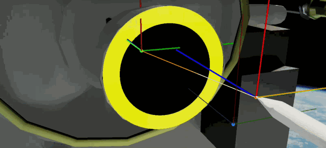
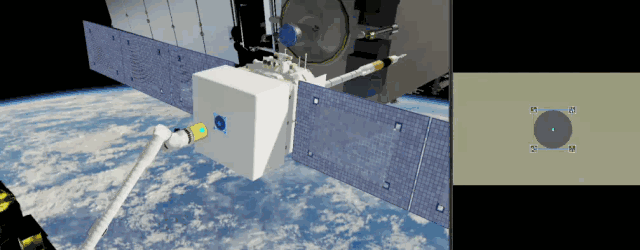
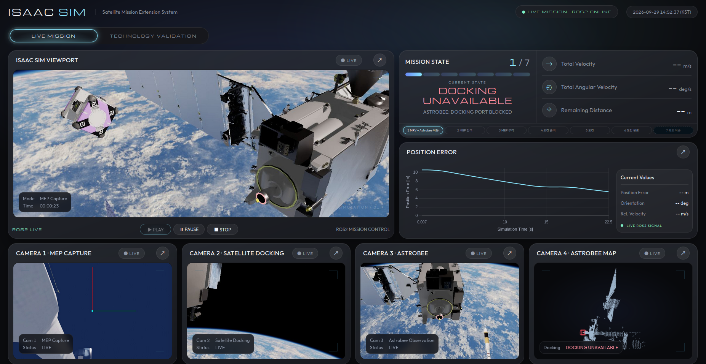
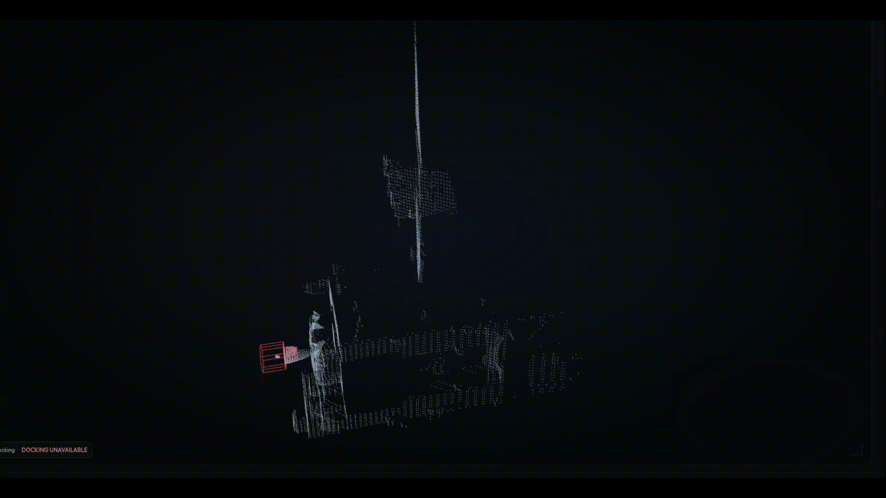
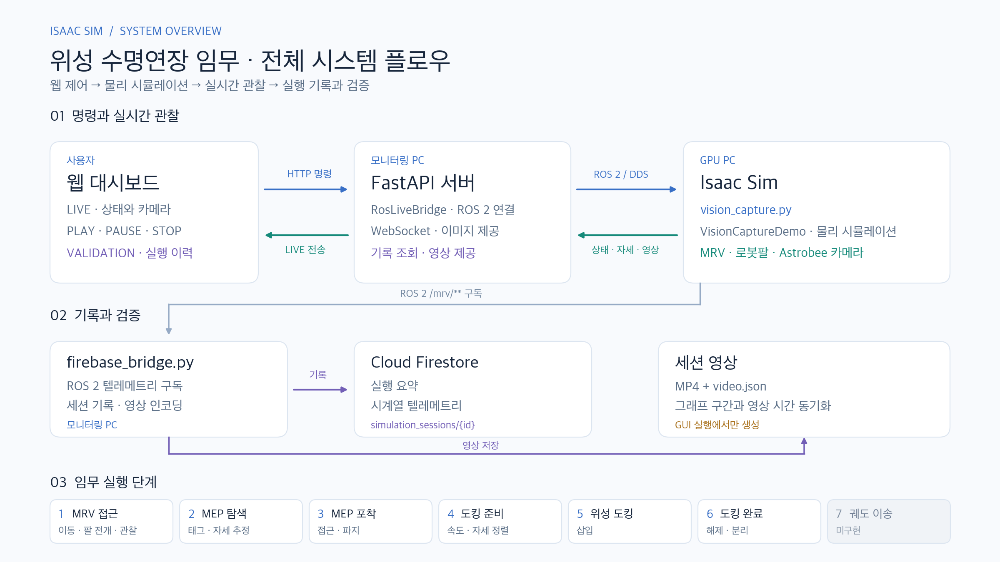

# Automated Satellite Mission Extension System

<p align="center">
  
  
  
  
  

  <a href="https://andrejorsula.github.io/space_robotics_bench/getting_started/install.html">
    
  </a>
  <a href="https://www.nasa.gov/astrobee/">
    
  </a>
  <a href="https://science.nasa.gov/3d-resources/">
    
  </a>

  
</p>

<p align="center">
       
    
</p>

## 0. 시스템 개요

Isaac Sim 기반 궤도상 위성 수명연장 임무 시뮬레이션과 실시간 모니터링 대시보드.

MRV(Mission Robotic Vehicle)가 표류하는 MEP(Mission Extension Pod)를 로봇팔로 포착해
목표 위성에 도킹합니다. Astrobee는 RGB-D 영상으로 위성 주변 포인트 클라우드를 쌓아 도킹 통로의 장애물을 확인합니다. 통로가 막혔거나 삽입 전까지 관측되지 않으면 도킹을 중단합니다.

```
┌─ GPU PC ─────────────────┐   ROS 2 (DDS)   ┌─ Monitoring PC ───────────────┐
│ Isaac Sim                │ ──────────────► │ firebase_bridge.py            │
│  vision_capture.py       │   /mrv/**       │  ├─ Firestore 기록             │
│  └ debris_capture task   │                 │  └ 세션 영상 녹화 (ffmpeg)       │
│                          │ ◄────────────── │                               │
│                          │  /mrv/cmd/start │ mep_dashboard (FastAPI)       │
└──────────────────────────┘                 │  ├─ LIVE: ROS 2 실시간         │
                                             │  └ VALIDATION: Firestore      │
                                             └───────────────────────────────┘
```

두 PC를 나눠 쓰지 않고 한 대에서 전부 실행해도 됩니다.



---

## 1. 요구 사항

pip 으로 설치되지 않는 것부터 준비합니다.

| 항목 | 버전 | 용도 |
|---|---|---|
| Isaac Sim | 5.x (`~/isaac-sim/python.sh`) | 시뮬레이션 실행 |
| ROS 2 | Jazzy | 시뮬레이터 ↔ 브리지/대시보드 통신 |
| ffmpeg | 6.x | 세션 영상 인코딩 (H.264) |
| Firebase | Firestore 사용 설정된 프로젝트 | 실행 이력 저장 |
| Ubuntu | 24.04 | 검증 환경 |

시뮬레이터 PC와 모니터링 PC의 `ROS_DOMAIN_ID` 가 같아야 합니다.


## 2. 설치

```bash
git clone <repo> isaac_space && cd isaac_space

# 모니터링 측 (웹 + DB 브리지). rclpy 는 ROS 2 설치본을 쓰므로 --system-site-packages 필수
source /opt/ros/jazzy/setup.bash
python3 -m venv --system-site-packages .venv
.venv/bin/python -m pip install -r requirements.txt

# 시뮬레이션 측 (srb 패키지를 Isaac Sim 인터프리터에 등록)
~/isaac-sim/python.sh -m pip install --editable project
```

Isaac Sim / Isaac Lab 공식 경로를 통해 설치 가능합니다. 

```
Isaac-Sim 설치 경로
https://docs.isaacsim.omniverse.nvidia.com/latest/index.html

Isaac-Lab 설치 경로
https://isaac-sim.github.io/IsaacLab/v2.2.1/source/setup/installation/binaries_installation.html#installing-isaac-lab
```

Isaac Sim / Isaac Lab 자체가 없다면 업스트림 설치 스크립트를 먼저 실행합니다.

```bash
project/scripts/install_isaacsim.bash
project/scripts/install_isaaclab.bash
project/scripts/setup_cli.bash        # srb CLI 셸 완성 (선택)
```

Firebase 서비스 계정 키를 저장소 루트에 `serviceAccount.json` 으로 둡니다.
**이 파일은 `.gitignore` 에 있으며 절대 커밋하지 않습니다.**
대시보드와 브리지 모두 이 경로를 자동으로 찾습니다.

Astrobee USD 는 소스 메시에서 한 번 빌드합니다.

```bash
~/isaac-sim/python.sh project/scripts/build_astrobee_usd.py
```

## 3. 실행

터미널 3개를 씁니다.

**① 웹 대시보드** → http://127.0.0.1:8000

```bash
cd mep_dashboard
source /opt/ros/jazzy/setup.bash
../.venv/bin/python -m uvicorn backend.app:app --host 0.0.0.0 --port 8000
```

**② DB 브리지**

```bash
source /opt/ros/jazzy/setup.bash
CRYPTOGRAPHY_OPENSSL_NO_LEGACY=1 .venv/bin/python project/scripts/firebase_bridge.py \
  --credentials serviceAccount.json
```

**③ 시뮬레이션**

```bash
source /opt/ros/jazzy/setup.bash
~/isaac-sim/python.sh project/scripts/vision_capture.py
```

브라우저에서 LIVE MISSION 탭의 **▶ PLAY** 를 누르면 `/mrv/cmd/start` 가 발행되고 임무가 시작됩니다.

### 주요 옵션 (`vision_capture.py`)

| 옵션 | 설명 |
|---|---|
| `--headless` | Isaac Sim 창 없이 실행. **MISSION VIDEO 는 기록되지 않습니다** (뷰포트 캡처가 GUI 전용) |
| `--no_dock` | 포착까지만, 도킹 단계 생략 |
| `--dock_only` | 도킹 단계만 |
| `--no_astrobee` | Astrobee 관찰 카메라·위성 맵 끔 (도킹 통로 판정도 생략) |
| `--nozzle_obstruction` | 위성 도킹부 앞에 떠다니는 시각 전용 부유물 배치 → Astrobee 스캔 맵에서 위성 모델로 설명되지 않는 물체로 감지, 그 즉시 `DOCKING_UNAVAILABLE`로 임무 중단 |
| `--exit_when_done` | 임무 종료 시 자동 종료 |
| `--tag NAME` | 출력 파일 이름 |
| `--set SECTION.KEY=VALUE` | `project/config/vision_capture.yaml` 값 덮어쓰기 (반복 가능) |

## 4. 임무 7단계

대시보드의 진행률은 아래 단계를 따릅니다.

| # | 단계 | 내용 |
|---|---|---|
| 1 | MRV MOVE + ASTROBEE | MRV 2단계 이동, 로봇팔 전개, Astrobee 관찰기 배치 |
| 2 | MEP SEARCH | AprilTag 검출 → 자세 추정 → 표류 예측 → 접근 |
| 3 | MEP ATTACH | 포착·파지·후퇴 |
| 4 | DOCK PREP | 도킹 대상 확보, 속도 정합, XY/자세 정렬 |
| 5 | DOCKING | Z축 접근, 최종 삽입, 도킹 |
| 6 | DOCK COMPLETE | 안정화, 로봇팔 해제·후퇴, MRV 분리 |
| 7 | ORBIT TRANSFER | 그리퍼 해제·팔 후퇴 후 MRV가 이격되고 `SUCCESS` 뒤에도 계속 이동합니다. 별도의 궤도 이송 제어 상태는 없으며, 현재 대시보드 코드는 이 동작을 6단계에 표시합니다 |

실패 상태는 실패한 단계 번호를 유지합니다 (1단계로 되돌아가지 않음).

각 객체의 역할과 실제 구현 파일을 펼쳐 볼 수 있습니다. 아래 항목은 동작 설명이지 객체별 실행 스위치가 아닙니다.

<details>
<summary>MRV · 포획·운반·분리</summary>

- **역할:** 2구간 접근 후 Canadarm3를 전개해 MEP를 포획·운반하고, 도킹 뒤 팔과 MRV를 분리합니다.
- **핵심 기능:** 손목 카메라의 AprilTag 추정·0.3초 예측을 DLS IK로 추종하고 포획·이송을 제어합니다. MRV 이동은 추력 동역학이 아닌 운동학적 이동입니다.
- **코드:** [`mrv_approach.py`](project/srb/tasks/manipulation/debris_capture/mrv_approach.py), [`vision.py`](project/srb/tasks/manipulation/debris_capture/vision.py), [`capture.py`](project/srb/tasks/manipulation/debris_capture/capture.py), [`vision_capture_demo.py`](project/srb/tasks/manipulation/debris_capture/vision_capture_demo.py)

</details>

<details>
<summary>MEP · 표류하는 수명연장 모듈</summary>

- **역할:** 포획 전에는 자유비행하며, 포획 후 MRV 팔에, 도킹 후 위성에 결합됩니다.
- **핵심 기능:** 부착면의 AprilTag로 포획 대상이 되고 Ares1 probe로 위성 노즐에 삽입됩니다. 포획·도킹 결합은 실제 흡착이나 래치가 아닌 `FixedJoint` 근사입니다.
- **코드:** [`task.py`](project/srb/tasks/manipulation/debris_capture/task.py), [`capture.py`](project/srb/tasks/manipulation/debris_capture/capture.py), [`docking.py`](project/srb/tasks/manipulation/debris_capture/docking.py)

</details>

<details>
<summary>Client Satellite · 도킹 대상</summary>

- **역할:** 추력기 노즐 내부의 도킹점을 제공하며, 이동 시나리오에서는 병진 표류합니다.
- **핵심 기능:** USD 메시에서 도킹 프레임을 측정하고, probe 정렬·깊이·상대속도 조건을 검사해 MEP와 결합합니다. 위성 도킹 pose는 엔진의 물리 상태에서 읽으며 별도 비전 위치 추정이 아닙니다. 도킹 후 MRV 이격·지속 이동은 구현되어 있지만 도킹 스택의 별도 궤도 변경 기동은 확인되지 않습니다.
- **코드:** [`docking.py`](project/srb/tasks/manipulation/debris_capture/docking.py), [`probe_dock.py`](project/srb/tasks/manipulation/debris_capture/probe_dock.py), [`moving_dock.py`](project/srb/tasks/manipulation/debris_capture/moving_dock.py)

</details>

<details>
<summary>Astrobee · 관측·포인트 클라우드 안전 게이트</summary>

- **역할:** 위성 주위를 비행하며 RGB 관찰 영상을 내고 depth로 위성 프레임의 3D 맵을 만듭니다. 위치·자세는 시뮬레이터 pose를 사용하며 별도로 추정하지 않습니다.
- **핵심 기능:** depth 역투영 → 3 cm 보셀 누적·free-space carving → 위성/MEP 메시로 설명되는 점 제외 → 노즐 안과 출구 앞 금지 구역의 이물질 판정. 통로 관측 2회 이상 확인 후 확정 장애물은 임무 중 `DOCKING_UNAVAILABLE`로 중단하고, 관측 부족도 삽입 전 게이트에서 도킹 불가로 판정합니다. ROS 2 포인트 맵·판정을 CAMERA 4에 표시합니다.
- **코드:** [`astrobee.py`](project/srb/tasks/manipulation/debris_capture/astrobee.py), [`astrobee_map.py`](project/srb/tasks/manipulation/debris_capture/astrobee_map.py), [`vision_capture_demo.py`](project/srb/tasks/manipulation/debris_capture/vision_capture_demo.py), [`map3d.js`](mep_dashboard/frontend/js/map3d.js)

</details>

## 5. 데이터

### Firestore

```
simulation_sessions/{session_id}                         # 실행 요약 (성공 여부, 오차, 소요 시간)
simulation_sessions/{session_id}/session_telemetry/{id}  # 시계열 (기본 5 Hz, sim_time 기준)
```

`session_id` 는 `run_YYYYMMDD_HHMMSS` 형식입니다. 자세한 필드는 [docs/03_interface_requirements.md](docs/03_interface_requirements.md) 참고.

### 세션 영상

`project/logs/vision_capture/<session_id>.mp4` 와 사이드카 `<session_id>.video.json`.
사이드카의 `t0_sim_s` 로 텔레메트리 `sim_time` ↔ 영상 시간을 맞추기 때문에,
대시보드에서 그래프 구간을 드래그하면 그 구간의 영상으로 이동합니다.

**GUI 실행에서만 생성됩니다.** 뷰포트 캡처가 headless 에서 동작하지 않습니다.

### 읽기 캐시

대시보드는 끝난 실행의 텔레메트리를 `mep_dashboard/.cache/validation/` 에 캐시합니다
(실행 1건이 Firestore 문서 읽기 800~2,000건이라 무료 한도가 금방 소진됩니다).
기록 중인 실행(`is_running: true`)은 캐시하지 않습니다.
Firestore 에 접근할 수 없으면 캐시본을 내려주고 화면 상단에 `CACHED DATA` 를 표시합니다.
초기화하려면 해당 폴더를 지우면 됩니다.

## 6. 대시보드

**LIVE MISSION** — ROS 2 실시간. Isaac Sim 뷰포트, 임무 상태와 진행률, 속도·각속도·잔여 거리,
위치 오차 그래프, 카메라 3면(MEP 포착 / 위성 도킹 / Astrobee 관찰) 및 CAMERA 4 · ASTROBEE MAP을 표시합니다.
CAMERA 4는 위성 좌표계의 보셀 맵과 노즐 금지 구역 윤곽을 그리고 장애물 점을 빨간색으로 표시합니다.
판정 전에는 `NOT OBSERVED`, 관측 후에는 `DOCKING AVAILABLE / UNAVAILABLE`을 표시합니다.
PLAY·PAUSE·STOP으로 시뮬레이터를 제어합니다.

**TECHNOLOGY VALIDATION** — Firestore 기록. 성공률·실행 횟수·평균 임무 시간·포착 반복 정밀도·도킹 정밀도,
실행 이력 표, 단계별 텔레메트리 그래프(구간 선택 → JSON 내보내기), 선택 구간의 임무 영상.
실행 종료 시 저장한 Astrobee 맵은 `GET /api/validation/runs/{id}/pointcloud`에서 `.ply`로 내려받을 수 있습니다(해당 실행에 맵이 있을 때).

## 7. 저장소 구조

```
├── requirements.txt              # 모니터링 측 pip 패키지 (Isaac Sim/ROS 2 는 별도)
├── assets/
│   ├── space_asset/              # MEP, 위성, Astrobee (이 프로젝트 자산)
│   └── srb_assets/               # 업스트림 자산 중 이 임무가 쓰는 것만 유지
├── project/
│   ├── config/vision_capture.yaml
│   ├── scripts/
│   │   ├── vision_capture.py     # 시뮬레이션 진입점
│   │   ├── firebase_bridge.py    # ROS 2 → Firestore + 영상 녹화
│   │   └── build_astrobee_usd.py
│   ├── srb/tasks/manipulation/debris_capture/   # 임무 구현
│   └── tests/
├── mep_dashboard/
│   ├── backend/app.py            # FastAPI: Firestore API + ROS 2 라이브 + 영상 서빙
│   ├── frontend/                 # HTML / CSS / Vanilla JS / Chart.js
│   └── checks/                   # 브라우저·캐시 검증 스크립트
└── docs/                         # 요구사항·시나리오·브랜치 이력·레퍼런스 (docs/README.md)
```

`project/srb/` 는 [Space Robotics Bench](https://github.com/AndrejOrsula/space_robotics_bench) 포크입니다.
이 프로젝트의 구현은 `srb/tasks/manipulation/debris_capture/` 에 있습니다.

## 8. 검증

```bash
cd project && uv run pytest tests            # 파이썬 테스트
python3 -m compileall -q project/srb         # 컴파일 검사

cd mep_dashboard
../.venv/bin/python checks/cache_check.py    # 캐시 동작 (Firestore 스텁, 네트워크 불필요)
../.venv/bin/python checks/browser_check.py  # 브라우저 스모크 (서버 실행 중이어야 함, playwright 필요)
```

USD·물리를 수정했다면 Isaac Sim 스모크 테스트를 함께 돌리고 명령·기준·결과를 기록합니다.

```bash
~/isaac-sim/python.sh project/scripts/vision_capture.py --headless --exit_when_done --tag smoke
```

## 9. 알려진 제약

- **도킹 후 MRV 이격은 구현**되어 있습니다. 설정상 이격 순항은 0.4 m/s로 15 s이고 최소 거리 증가 판정은 0.1 m입니다. `SUCCESS` 후에도 MRV가 계속 이동합니다. 다만 현재 대시보드의 상태 매핑은 이를 6단계로 표시하며, 별도의 궤도 변경 제어·7단계 텔레메트리는 확인되지 않습니다.
- **headless 실행에는 MISSION VIDEO 가 없습니다.** 뷰포트 캡처가 GUI 전용입니다.
- **Firestore 무료 한도**는 하루 읽기 50,000건입니다. 소진되면 대시보드가 캐시본으로 동작하고,
  미국 태평양시 자정에 리셋됩니다.
- 브리지를 `kill -9` 로 종료하면 영상이 `.mp4.part` 로 남습니다. `Ctrl+C` 로 종료하세요.
  남은 파일은 `ffmpeg -i <file>.mp4.part -c copy out.mp4` 로 복구할 수 있습니다.
- 네트워크가 끊기면 브리지가 5회 재시도 후 해당 배치를 버립니다(로그에 `dropped N writes`).
  그 실행의 텔레메트리는 일부 누락됩니다.

## 출처

https://andrejorsula.github.io/space_robotics_bench/index.html

## 라이선스

업스트림 Space Robotics Bench 를 따라 MIT OR Apache-2.0 (`project/LICENSE-MIT`, `project/LICENSE-APACHE`).
