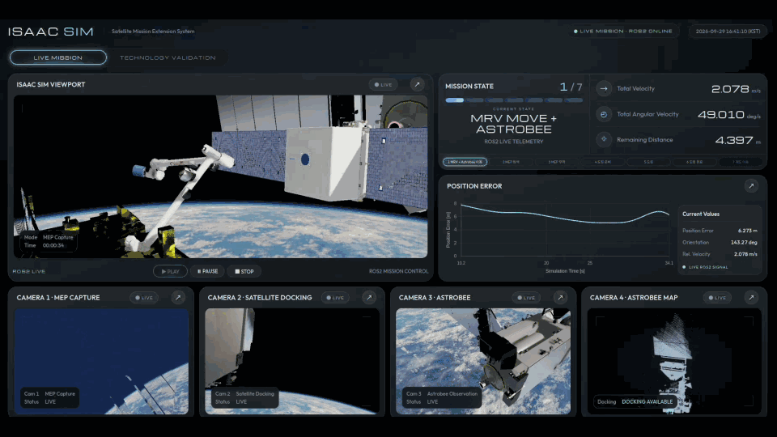
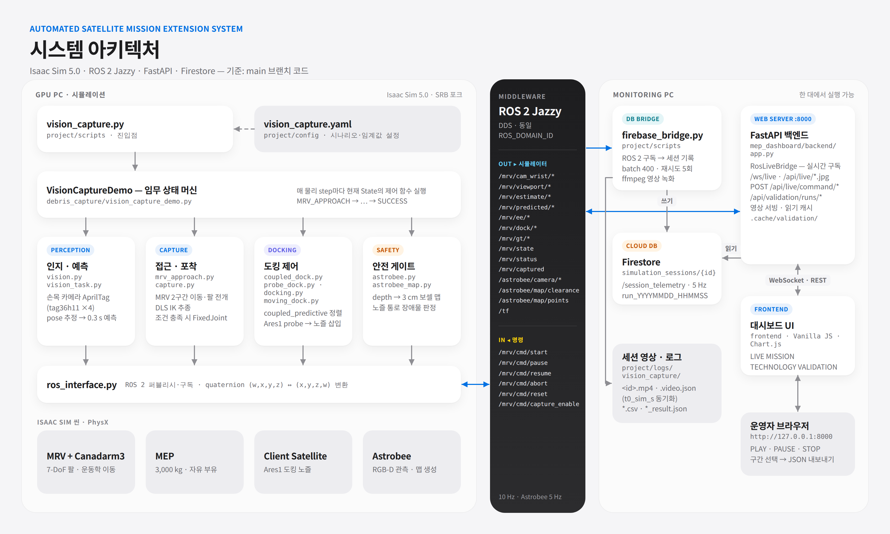
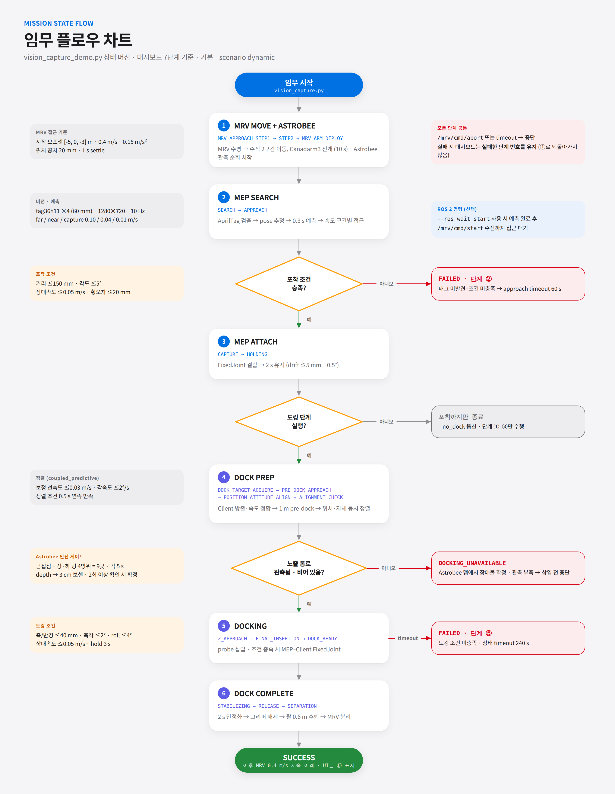

# Automated Satellite Mission Extension System

---

<p align="center">
  
  
  
  
  

  <a href="https://andrejorsula.github.io/space_robotics_bench/getting_started/install.html">
    
  </a>
  <a href="https://www.nasa.gov/astrobee/">
    
  </a>
  <a href="https://science.nasa.gov/3d-resources/">
    
  </a>

  
</p>

<p align="center">
  
  
  
  
</p>

Isaac Sim에서 **MRV가 표류하는 MEP(수명연장 모듈)를 포획해 목표 위성에 도킹하고 분리하는 임무**를 시뮬레이션합니다. Canadarm3 손목 카메라의 AprilTag 관측으로 포획점을 추정하고, Astrobee의 RGB-D 포인트 클라우드로 도킹 통로를 확인합니다. ROS 2로 상태·영상을 전달하고 FastAPI 대시보드와 Firestore로 임무를 모니터링·기록합니다.

포획과 도킹의 결합은 흡착력이나 실제 래치가 아닌 **`FixedJoint` 근사**입니다. MRV와 Astrobee의 이동도 추력 동역학이 아닌 운동학적 이동입니다. 위성 도킹 pose는 별도 비전 추정 없이 시뮬레이터 물리 상태에서 가져옵니다.

## 주요 기능

- **MEP 탐색·포획:** 손목 RGB 카메라의 AprilTag 4개로 결합점 pose를 추정하고 0.3초 앞을 예측해 7자유도 Canadarm3를 DLS IK로 추종합니다. 포획 조건을 만족하면 MRV 팔에 결합합니다.
- **위성 도킹·분리:** 이동 위성과 속도를 맞추고 Ares1 probe를 추력기 노즐에 정렬·삽입합니다. 도킹 후 팔의 결합을 해제하고 MRV를 이격합니다. 기본 제어 모드는 `coupled_predictive`이며 `legacy`로 변경할 수 있습니다.
- **Astrobee 안전 게이트:** 위성 주위를 관찰하며 RGB-D depth를 3 cm 보셀 맵으로 누적합니다. 노즐 통로의 장애물 확정 또는 삽입 전 관측 부족이면 도킹을 중단합니다. Astrobee는 도킹 제어 명령을 내리지 않습니다.
- **실시간 모니터링·기록:** ROS 2 상태·카메라·포인트 맵을 LIVE 화면에 표시하고, Firestore에 임무 요약·시계열을 기록합니다. GUI 실행에서는 세션 영상을 녹화해 검증 화면의 그래프와 동기화합니다.
- **시나리오 선택:** 동적/정적 MEP, 도킹만/포획만, Astrobee 제외, YAML·CLI 설정 덮어쓰기를 지원합니다.

## 시스템 구성



GPU PC의 `vision_capture.py`가 Isaac Sim 장면과 임무 상태 머신을 실행합니다. ROS 2 DDS는 상태·영상·맵을 `firebase_bridge.py`와 FastAPI LIVE 화면에 전달하며, 대시보드는 임무 명령을 반대로 발행합니다. 브리지는 Firestore에 시계열을 기록하고 GUI 뷰포트 영상을 인코딩합니다. 대시보드의 VALIDATION은 Firestore 기록과 세션 파일을 조회합니다. 세 프로세스는 한 대에서 실행하거나 시뮬레이터와 모니터링 PC로 나눌 수 있습니다.

<details>
<summary><strong>임무 상태 흐름 보기</strong></summary>



</details>

대시보드에는 MRV 접근 → MEP 탐색·포획 → 도킹 준비·삽입 → 분리·성공의 **7단계 진행률**이 있습니다. 현재 MRV 이격·`SUCCESS`는 화면상 6단계에 매핑되며, 별도 궤도 변경 상태나 7단계 텔레메트리는 없습니다. [객체별 구현과 단계 설명](#임무-7단계)을 참고하세요.

## 기술 스택

| 구분 | 구성 |
|---|---|
| 시뮬레이션 | Isaac Sim 5.0.0, Isaac Lab 2.2.1, Space Robotics Bench(SRB) 포크, USD/PhysX |
| 비전·제어 | AprilTag, RGB-D, depth 포인트 클라우드, DLS IK, `FixedJoint` |
| 통신 | ROS 2 Jazzy (`rclpy`, DDS, `sensor_msgs`, `geometry_msgs`, `std_msgs`, TF) |
| 서버·화면 | Python 3.12, FastAPI, Uvicorn, HTML/CSS/Vanilla JS, Chart.js, Three.js |
| 데이터·영상 | Firebase Firestore, ffmpeg(H.264), CSV/JSON/PLY |
| 시뮬레이터 Python | Isaac Sim의 Python 3.11 (`project/pyproject.toml`: `==3.11.*`) |

## 요구사항 및 환경 구성

| 항목 | 준비 기준 |
|---|---|
| 시뮬레이터 PC | Ubuntu 24.04 x86_64, NVIDIA RTX GPU와 Isaac Sim 5.0.0 지원 드라이버. [NVIDIA 하드웨어 요구사항](https://docs.isaacsim.omniverse.nvidia.com/5.1.0/installation/requirements.html)은 5.1 기준 참고선 |
| 시뮬레이터 소프트웨어 | Isaac Sim 5.0.0(`~/isaac-sim/python.sh`), Isaac Lab v2.2.1, 이 저장소의 `project` 패키지 |
| 모니터링 PC | Ubuntu 24.04, ROS 2 Jazzy, 시스템 Python 3.12, ffmpeg(`libx264`), Firestore 접근 |
| 통신·저장 | 호스트를 나누면 동일한 `ROS_DOMAIN_ID`와 DDS 연결이 필요합니다. 세션 영상을 웹에서 보려면 브리지와 대시보드가 같은 영상 경로를 볼 수 있어야 합니다 |

GPU 4코어·RAM 32 GB·SSD 여유 50 GB·RTX 4080/16 GB급은 [NVIDIA 사양표](https://docs.isaacsim.omniverse.nvidia.com/5.1.0/installation/requirements.html)를 참고한 장비 계획선이지 이 장면의 성능 보증값이 아닙니다. 모니터링 측 `.venv`는 `--system-site-packages`로 만들어 시스템 ROS 2의 `rclpy`를 사용하며, Isaac Sim Python과 패키지를 섞지 않습니다.

임무 설정은 [`project/config/vision_capture.yaml`](project/config/vision_capture.yaml), 장면·제어는 [`project/srb/tasks/manipulation/debris_capture/`](project/srb/tasks/manipulation/debris_capture/)에 있습니다. 시뮬레이션 자산의 USD 참조 경로는 환경에 따라 점검해야 합니다(아래 설치 4단계).

## 사용한 장비

| 항목 | 사양 |
|---|---|
| 노트북 | MSI GPU 노브북 |
| OS | Ubuntu 24.04 |
| GPU | RTX 5080 |
| VRAM | 16GB (16303MiB) |
| NVIDIA Driver | 580.142 |
| CUDA Version | 13.0 |
| RAM | 62GB |
| Swap | 8GB |
| Storage | 938GB NVMe |
| ROS 2 | Jazzy |
| OS Python | 3.12 |
| Isaac Sim 내장 Python | 3.11 |


## 저장소 구성

| 경로 | 역할 |
|---|---|
| `assets/space_asset/` · `assets/srb_assets/` | MEP·위성·Astrobee 및 SRB 기반 장면 자산 |
| `project/config/vision_capture.yaml` | 임무·센서·ROS 기본 설정 |
| `project/scripts/vision_capture.py` | Isaac Sim 임무 실행 진입점과 CLI |
| `project/scripts/firebase_bridge.py` | ROS 2 → Firestore 기록·영상·포인트 맵 저장 |
| `project/scripts/build_astrobee_usd.py` | NASA Astrobee 소스 메시 → USD 생성 |
| `project/srb/tasks/manipulation/debris_capture/` | 임무 상태 머신, 인지, 포획, 도킹, Astrobee 안전 게이트 |
| `mep_dashboard/backend/` · `mep_dashboard/frontend/` | FastAPI API·ROS LIVE 및 웹 UI |
| `docs/` · `project/tests/` | 온보딩·요구사항·인터페이스 문서와 오프라인 테스트 |

`project/srb/`는 [Space Robotics Bench](https://github.com/AndrejOrsula/space_robotics_bench) 포크이며, 이 임무의 코드는 `debris_capture/`에 있습니다.

## 설치 및 준비

모든 명령은 별도 표시가 없으면 **저장소 루트**에서 실행합니다. 두 PC 구성이라면 각 PC에 저장소를 받고, 시뮬레이션 단계는 GPU PC에서, 모니터링 단계는 모니터링 PC에서 수행합니다.

### 1. 저장소 받기 및 플랫폼 설치

```bash
git clone https://github.com/mi1nn/satellite-mission-extension-system.git isaac_space
cd isaac_space
```

GPU PC에 [Isaac Sim 5.0.0](https://docs.isaacsim.omniverse.nvidia.com/latest/installation/install_workstation.html) 설치 파일을 준비해 `~/isaac-sim`에 설치한 뒤, [Isaac Lab v2.2.1](https://isaac-sim.github.io/IsaacLab/v2.2.1/source/setup/installation/binaries_installation.html#installing-isaac-lab)을 준비합니다. NVIDIA 링크는 최신 버전 문서이므로 설치 파일은 **5.0.0** 버전을 선택하세요. 모니터링 PC에는 [ROS 2 Jazzy](https://docs.ros.org/en/jazzy/Installation/Ubuntu-Install-Debs.html), Python 3.12와 ffmpeg를 설치합니다. ROS LIVE가 필요하면 GPU PC에도 ROS 2 환경을 준비합니다.

새 설치 경로에 한해 저장소의 설치 스크립트를 대신 쓸 수 있습니다. **기존 설치 폴더가 있으면 스크립트가 덮어쓸지 묻고 승인 시 삭제합니다.** 기존 설치를 보존하려면 공식 설치 절차를 이용하세요.

```bash
project/scripts/install_isaacsim.bash
ISAAC_SIM_PYTHON="$HOME/isaac-sim/python.sh" project/scripts/install_isaaclab.bash
```

### 2. 시뮬레이터 패키지와 Astrobee 자산

```bash
~/isaac-sim/python.sh -m pip install --editable project
~/isaac-sim/python.sh project/scripts/build_astrobee_usd.py
```

Astrobee USD는 저장소의 NASA 소스 메시를 변환해 `assets/space_asset/astrobee/parts/`를 생성해야 완성됩니다. `python.sh` 설치 경로가 다르면 위 명령을 수정하고 `ISAAC_PATH`와 설치 스크립트의 `ISAAC_SIM_PYTHON`도 같은 Isaac Sim을 가리키도록 설정합니다.

### 3. 모니터링 Python 환경과 Firestore

```bash
source /opt/ros/jazzy/setup.bash
python3 -m venv --system-site-packages .venv
.venv/bin/python -m pip install -r requirements.txt
```

Firestore가 활성화된 Firebase 프로젝트에서 받은 서비스 계정 JSON을 **모니터링 PC의** 저장소 루트 `serviceAccount.json`에 안전하게 배치합니다. 이 파일은 `.gitignore` 대상이며 배포·커밋하지 않습니다. 다른 경로를 쓴다면 브리지 `--credentials`와 웹 `FIREBASE_CREDENTIALS`를 각각 지정하세요.

### 4. 장면 자산과 통신 점검

`assets/space_asset/debris_v3.usd` → `3asset_v3.usd` → `mep_combined.usd` 참조 체인에 제작 환경의 절대 경로(`/home/rokey/space_asset/mep.usd`)가 남아 있습니다. **클린 클론에서 바로 장면이 열리는 것으로 가정하지 말고**, Isaac Sim에서 자산 참조가 현재 `assets/space_asset/mep.usd`로 해석되는지 확인·수정한 뒤 실행하세요. USD 파일을 직접 바꾸는 경우 원본을 보존하고 작업 환경에서 재검증해야 합니다.

두 호스트를 쓰면 아래 **멀티 PC ROS 2 통신 설정**을 양쪽 PC에 적용하고 DDS 통신을 확인하세요. 영상 재생은 브리지의 `--video_dir`와 대시보드의 `MRV_RUN_VIDEO_DIR`를 **공유 경로**로 맞춰야 합니다. 별도 GPU/모니터링 PC에서 실행하더라도 브리지와 웹은 같은 파일을 볼 수 있어야 합니다.

<details>
<summary><strong>멀티 PC ROS 2 통신 설정 (Fast DDS · 유선 전용)</strong></summary>

**양쪽 PC에서 실행합니다.** 아래 `10.10.0.1`~`10.10.0.4`는 예시 유선 IP입니다. 각 PC의 실제 유선 IP와 대역을 `ip -br -4 addr`로 확인하고 서로 `ping`이 되는지 먼저 검사하세요. 두 PC 모두 ROS 2 Jazzy와 `rmw_fastrtps_cpp`가 설치되어 있어야 합니다. Wi-Fi·VPN을 통한 ROS 통신은 이 예제에서 제외됩니다.

1. **방화벽 상태 확인.** 먼저 `sudo ufw status`로 양쪽 PC의 상태를 확인합니다. `ufw` 전체 비활성화는 다른 서비스도 노출하므로 기본 절차가 아닙니다. 방화벽이 원인인지 확인해야 하는 **격리된 테스트망에서만** `sudo ufw disable`로 일시 진단하고, 원래 활성 상태였으면 테스트 직후 `sudo ufw enable`로 복구하세요. 운영 환경에서는 해당 유선 인터페이스에 필요한 DDS UDP 통신만 허용하세요.

2. **모든 PC의 도메인과 RMW 통일.** `~/.bashrc`에 아래 세 줄을 한 번씩 추가합니다. 이미 다른 `ROS_DOMAIN_ID`나 `RMW_IMPLEMENTATION`이 있으면 중복 추가하지 말고 교체하세요. `ROS_DISTRO`는 수동으로 지정하지 않습니다. `/opt/ros/jazzy/setup.bash`를 읽으면 설정됩니다.

   ```bash
   # ~/.bashrc — PC1, PC2(추가 PC도 동일)
   export ROS_DOMAIN_ID=50
   export RMW_IMPLEMENTATION=rmw_fastrtps_cpp
   export FASTRTPS_DEFAULT_PROFILES_FILE="$HOME/.ros/fastdds_whitelist.xml"
   ```

3. **유선 인터페이스만 허용.** 각 PC에서 `mkdir -p ~/.ros`를 실행하고, 기존 파일이 있다면 백업한 뒤 `~/.ros/fastdds_whitelist.xml`을 다음 내용으로 작성합니다. 파일의 `10.10.0.1`~`10.10.0.4`는 **원격 허용 목록이 아니라 각 호스트의 로컬 인터페이스 후보**입니다. 실제 유선 주소가 목록에 없는 PC는 PC 간 ROS 통신이 끊기므로 주소를 바꾸거나 자신의 유선 주소만 남기세요. `127.0.0.1`은 동일 PC 내 노드 통신용입니다.

   ```bash
   mkdir -p ~/.ros
   cat > ~/.ros/fastdds_whitelist.xml <<'EOF'
   <?xml version="1.0" encoding="UTF-8"?>
   <profiles xmlns="http://www.eprosima.com/XMLSchemas/fastRTPS_Profiles">
     <transport_descriptors>
       <transport_descriptor>
         <transport_id>wired_udp</transport_id>
         <type>UDPv4</type>
         <interfaceWhiteList>
           <address>127.0.0.1</address>
           <address>10.10.0.1</address>
           <address>10.10.0.2</address>
           <address>10.10.0.3</address>
           <address>10.10.0.4</address>
         </interfaceWhiteList>
       </transport_descriptor>
     </transport_descriptors>
     <participant profile_name="wired_only" is_default_profile="true">
       <rtps>
         <userTransports>
           <transport_id>wired_udp</transport_id>
         </userTransports>
         <useBuiltinTransports>false</useBuiltinTransports>
       </rtps>
     </participant>
   </profiles>
   EOF
   ```

   Fast DDS 2.x의 공식 XML 예시에 맞춰 루트 요소를 `<profiles>`로 사용합니다. `useBuiltinTransports=false`는 내장 전송(SHM 포함)을 끄므로 이 예제는 지정한 UDP 인터페이스만 사용합니다. [Fast DDS 인터페이스 화이트리스트](https://fast-dds.docs.eprosima.com/en/v2.14.5/fastdds/transport/whitelist.html)와 [프로파일 환경 변수](https://fast-dds.docs.eprosima.com/en/v2.14.5/fastdds/env_vars/env_vars.html)를 참고하세요.

4. **새 셸에 적용하고 확인.** 이전에 실행한 ROS 노드·대시보드·브리지·시뮬레이터는 환경 변수를 다시 읽지 않으므로 설정 후 재시작합니다. 아래 명령을 각 PC의 새 터미널에서 실행하세요.

   ```bash
   source ~/.bashrc
   source /opt/ros/jazzy/setup.bash
   echo "ROS_DOMAIN_ID=$ROS_DOMAIN_ID"
   echo "ROS_DISTRO=$ROS_DISTRO"
   echo "RMW_IMPLEMENTATION=$RMW_IMPLEMENTATION"
   echo "FASTRTPS_DEFAULT_PROFILES_FILE=$FASTRTPS_DEFAULT_PROFILES_FILE"
   test -f "$FASTRTPS_DEFAULT_PROFILES_FILE" && echo "Fast DDS XML: OK"
   ```

5. **동일 PC → PC 간 순서로 ROS 2 테스트.** 아래 두 터미널 모두 4단계와 동일한 환경에서 실행합니다. 먼저 같은 PC에서 `talker`/`listener`가 연결되는지 확인하고, 이어서 **PC1에서 talker, PC2에서 listener**로 바꿔 메시지가 수신되는지 확인합니다. 필요하면 방향을 바꿔 재시험하세요. `demo_nodes_py`가 없다면 `ros-jazzy-demo-nodes-py` 패키지를 설치합니다.

   ```bash
   # 터미널 A (동일 PC 시험, 이후 PC1)
   source ~/.bashrc
   source /opt/ros/jazzy/setup.bash
   ros2 run demo_nodes_py talker
   ```

   ```bash
   # 터미널 B (동일 PC 시험, 이후 PC2)
   source ~/.bashrc
   source /opt/ros/jazzy/setup.bash
   ros2 run demo_nodes_py listener
   ```

   `listener`에 `I heard: [...]`가 출력되면 두 노드 사이 통신을 확인한 것입니다. 이후 시뮬레이터를 실행하고 모니터링 PC에서 `ros2 topic echo --once /mrv/status`로 실제 임무 토픽을 확인하세요. 멀티 PC에서 실패하면 양쪽 유선 IP·서브넷, `ufw status`, 도메인 ID, RMW 구현과 XML 경로, `ROS_LOCALHOST_ONLY` 설정, 스위치의 multicast 전달 여부를 차례로 확인합니다. [`ROS_DOMAIN_ID` 가이드](https://docs.ros.org/en/jazzy/Concepts/Intermediate/About-Domain-ID.html)에 따르면 `50`은 Linux의 일반 안전 범위 안에 있습니다.

</details>

## 실행 방법

터미널 3개를 씁니다.
각 명령은 해당 PC의 **저장소 루트**에서 시작합니다. 두 호스트에서 실행한다면 브리지·웹은 모니터링 PC, 시뮬레이터는 GPU PC에서 실행하세요. 모니터링 PC는 같은 파일 경로에서 영상·포인트 맵을 읽습니다.

**① 웹 대시보드** → http://127.0.0.1:8000

```bash
cd mep_dashboard
source /opt/ros/jazzy/setup.bash
../.venv/bin/python -m uvicorn backend.app:app --host 0.0.0.0 --port 8000
```

**② DB 브리지**

```bash
source /opt/ros/jazzy/setup.bash
CRYPTOGRAPHY_OPENSSL_NO_LEGACY=1 .venv/bin/python project/scripts/firebase_bridge.py \
  --credentials serviceAccount.json
```

**③ 시뮬레이션**

```bash
source /opt/ros/jazzy/setup.bash
~/isaac-sim/python.sh project/scripts/vision_capture.py
```

브라우저에서 LIVE MISSION 탭의 **▶ PLAY** 는 `/mrv/cmd/start` 를 발행합니다. `--ros_wait_start` 를 지정한 경우 예측 완료 후 이 명령을 기다렸다가 포착 접근을 시작합니다. 기본 실행은 이 명령을 기다리지 않습니다.

### 주요 옵션 (웹 대시보드)

웹 서버는 `backend.app` 전용 CLI가 아닌 `uvicorn` 옵션과 환경 변수로 설정합니다.

| 옵션 / 환경 변수 | 설명 |
|---|---|
| `--host HOST` | 수신 주소. 실행 예시는 `0.0.0.0` (모든 네트워크 인터페이스); 로컬 전용이면 `127.0.0.1` |
| `--port PORT` | 웹 접속 포트. 실행 예시는 `8000` (사용 중이면 `8001` 등으로 변경) |
| `FIREBASE_CREDENTIALS` | Firestore 서비스 계정 JSON 경로. 미지정 시 `GOOGLE_APPLICATION_CREDENTIALS`, 저장소 루트의 `serviceAccount.json` 순서로 사용 |
| `FIREBASE_PROJECT_ID` | Firestore 프로젝트 ID 명시 (미지정 시 자격 증명/기본 설정 사용) |
| `MRV_RUN_VIDEO_DIR` | 영상·포인트 클라우드 파일 위치 (기본 `project/logs/vision_capture/`; 브리지의 `--video_dir`와 맞출 것) |
| `MEP_DASHBOARD_CACHE_DIR` | 검증 데이터 캐시 디렉터리 (기본 `mep_dashboard/.cache/validation/`) |
| `MEP_DASHBOARD_RUNS_TTL_S` | 실행 목록 캐시 유효 시간, 초 단위 (기본 `60`) |

ROS 2 LIVE 연결을 사용한다면 웹·브리지·시뮬레이터의 `ROS_DOMAIN_ID`를 동일하게 설정합니다.

### 주요 옵션 (DB 브리지: `firebase_bridge.py`)

| 옵션 | 설명 |
|---|---|
| `--namespace NAME` | 구독할 시뮬레이터 ROS 네임스페이스 (기본 `mrv`) |
| `--credentials FILE` | 서비스 계정 JSON 경로 (미지정 시 `GOOGLE_APPLICATION_CREDENTIALS`, 없으면 기본 인증 사용) |
| `--project_id ID` | Firebase 프로젝트 ID (미지정 시 자격 증명/기본 설정 사용) |
| `--rate_hz HZ` | 시뮬레이션 시간 기준 텔레메트리 기록 빈도 (기본 `5` Hz) |
| `--session_id ID` | 첫 세션의 ID 지정 (미지정 시 `run_YYYYMMDD_HHMMSS` 형식으로 생성) |
| `--idle_timeout SEC` | `/status` 수신이 끊긴 뒤 세션 종료까지의 실제 시간 (기본 `30`초) |
| `--dry_run` | Firestore에 쓰지 않고 기록할 내용을 표준 출력에 표시 |
| `--video_dir DIR` | 세션 영상·포인트 클라우드 저장 경로 (기본 `project/logs/vision_capture/`; 웹의 `MRV_RUN_VIDEO_DIR`와 맞출 것) |
| `--video_fps FPS` | 시뮬레이션 시간 기준 영상 프레임률 (기본 `10`) |
| `--no_video` | 세션 영상 녹화 생략 |
| `--map_topic TOPIC` | 저장할 포인트 클라우드 ROS 토픽 (기본 `/astrobee/map/points`) |
| `--no_map` | 세션 포인트 클라우드 저장 생략 |

### 주요 옵션 (`vision_capture.py`)

| 옵션 | 설명 |
|---|---|
| `--scenario {static,dynamic}` | 기본 `dynamic`: 포획·이동 위성 도킹. `static`: 정지 MEP 포착만 수행 (도킹·기본 MRV 접근 생략) |
| `--headless` | Isaac Sim 창 없이 실행. **MISSION VIDEO 는 기록되지 않습니다** (뷰포트 캡처가 GUI 전용) |
| `--no_dock` | 포착까지만, 도킹 단계 생략 |
| `--dock_only` | 포착을 건너뛰고 MEP를 기준 파지 위치에 부착한 뒤 도킹 |
| `--no_moving_dock` | 위성을 방출하지 않고 정지 위성에 도킹 (기본 `dynamic`에서는 이동 위성 도킹) |
| `--no_mrv_approach` | MRV 2구간 접근·팔 전개를 생략하고 관찰 자세에서 시작 |
| `--start_yaw_deg DEG` | 시작 시 팔의 방위각 오프셋 설정 (설정 기본값 15°) |
| `--no_astrobee` | Astrobee 관찰 카메라·위성 맵 끔 (도킹 통로 판정도 생략) |
| `--nozzle_obstruction` | 위성 도킹부 앞에 시각 전용 부유물 배치. Astrobee 맵에서 장애물로 판정하면 삽입 전 `DOCKING_UNAVAILABLE`로 중단 (`--no_astrobee`와 함께 사용 불가) |
| `--no_ros` | ROS 2 연동 끔 (기본 켜짐; 대시보드 실시간 데이터·명령 사용 불가) |
| `--ros_wait_start` | 예측 완료 후 `/mrv/cmd/start` 명령이 올 때까지 포착 접근 대기 (기본값은 대기하지 않음) |
| `--exit_when_done` | GUI에서 임무 종료 시 자동으로 창 닫기 |
| `--out_dir DIR` | 결과 저장 디렉터리 (기본 `project/logs/vision_capture/`) |
| `--tag NAME` | 결과 파일 이름의 접두어 (기본 시나리오 이름) |
| `--config FILE` | 설정 YAML 경로 (기본 `project/config/vision_capture.yaml`) |
| `--set SECTION.KEY=VALUE` | 설정 YAML 값 덮어쓰기 (반복 가능) |

## 외부 패키지·자산

| 대상 | 준비 방식 / 출처 |
|---|---|
| [Isaac Sim 5.0.0](https://docs.isaacsim.omniverse.nvidia.com/latest/index.html) · [Isaac Lab v2.2.1](https://isaac-sim.github.io/IsaacLab/v2.2.1/) | 시스템 설치가 선행되어야 합니다. 이 저장소 `project`는 Isaac Sim Python에 editable 설치합니다 |
| [Space Robotics Bench](https://github.com/AndrejOrsula/space_robotics_bench) | `project/srb/`에 포크가 포함되어 있습니다. 별도 SRB clone 명령은 필요하지 않습니다 |
| [NASA Astrobee 메시](https://github.com/nasa/astrobee_media) | `assets/space_asset/astrobee/source/`에 입력 메시가 포함되어 있으며, Isaac Sim 변환기로 USD를 생성합니다 |
| [ROS 2 Jazzy](https://docs.ros.org/en/jazzy/) · ffmpeg | `pip` 의존성이 아니므로 시스템에 따로 설치합니다. `rclpy`는 시스템 ROS 설치본을 사용합니다 |
| FastAPI · Uvicorn · Firebase Admin · NumPy · Pillow | 모니터링 호스트의 [`requirements.txt`](requirements.txt)에서 설치합니다. NumPy는 ROS ABI 호환을 위해 1.x 범위입니다 |
| Chart.js · Three.js | 웹 화면에 필요한 파일이 `mep_dashboard/frontend/js/vendor/`에 포함되어 있어 별도 npm 설치가 없습니다 |
| Firebase Firestore | 외부 서비스입니다. 프로젝트와 자격 증명은 사용자가 별도로 준비해야 하며 키 파일은 저장소에 포함되지 않습니다 |

MEP·위성 USD의 제작 환경 절대 경로는 [설치 4단계](#4-장면-자산과-통신-점검)에서 점검하세요. 외부 자산과 포크의 라이선스는 아래 [라이선스](#라이선스)를 따로 확인해야 합니다.

## ROS 2 인터페이스

방향은 **시뮬레이터 기준**입니다. 기본 네임스페이스는 `/mrv`와 `/astrobee`이며 `project/config/vision_capture.yaml`에서 바꿀 수 있습니다. 출력은 `--no_ros`에서 꺼지고 Astrobee 토픽은 `--no_astrobee`에서도 꺼집니다. 메시지는 world frame·SI 단위이며 quaternion은 ROS 순서 `(x,y,z,w)`를 사용합니다.

| 방향 | 토픽 (기본값) | 타입 | 역할 |
|---|---|---|---|
| 출력 | `/mrv/cam_wrist/image_raw`, `/mrv/cam_wrist/camera_info` | `sensor_msgs/Image`, `sensor_msgs/CameraInfo` | 손목 AprilTag 영상·카메라 파라미터; 영상은 조건 충족 시 최대 5 Hz |
| 출력 | `/mrv/cam_probe/image_raw`, `/mrv/viewport/image_raw` | `sensor_msgs/Image` | probe 카메라(도킹 관찰)·GUI 뷰포트; 뷰포트는 headless에서 없음 |
| 출력 | `/mrv/estimate/cylinder_pose`, `/mrv/predicted/cylinder_pose`, `/mrv/ee/pose`, `/mrv/ee/target_pose` | `geometry_msgs/PoseStamped` | 포획점 추정·예측 및 로봇팔 현재·목표 pose; 유효 값이 있을 때만 발행 |
| 출력 | `/mrv/dock/probe_pose`, `/mrv/dock/target_pose`, `/mrv/estimate/mep_twist` | `PoseStamped` 2개, `geometry_msgs/TwistStamped` | 도킹 포즈·MEP 추정 속도; 도킹 포즈는 도킹 중에만 발행 |
| 출력 | `/mrv/gt/cylinder_pose`, `/mrv/gt/mep_twist`, `/tf` | `PoseStamped`, `TwistStamped`, `tf2_msgs/TFMessage` | 평가용 GT(설정에서 허용 시)와 좌표계 변환; GT는 포획 제어 입력이 아님 |
| 출력 | `/mrv/state`, `/mrv/captured`, `/mrv/status` | `std_msgs/String`, `std_msgs/Bool`, `std_msgs/String`(JSON) | 상태·결합 여부·메트릭; `status` 설정 주기는 10 Hz이며 Firestore 브리지와 LIVE 화면이 구독 |
| 출력 | `/astrobee/camera/image_raw`, `/astrobee/map/clearance`, `/astrobee/map/points` | `sensor_msgs/Image`, `std_msgs/String`(JSON), `sensor_msgs/PointCloud2` | Astrobee RGB 영상(최대 5 Hz), 통로 판정, 위성 프레임 보셀 맵(변경 시 기본 최소 2초 간격) |
| 입력 | `/mrv/cmd/start`, `/mrv/cmd/pause`, `/mrv/cmd/resume`, `/mrv/cmd/abort` | `std_msgs/Empty` | 시작 게이트·일시정지·재개·중단. `start`는 `--ros_wait_start`에서만 접근 대기 게이트 |
| 입력 | `/mrv/cmd/capture_enable` | `std_msgs/Bool` | `false`이면 추적만 하고 포획 결합을 금지; 현재 웹 명령에는 없음 |

`/mrv/cmd/reset`은 ROS 구독만 있고 임무 초기화 경로가 연결되어 있지 않으므로 실행 명령으로 안내하지 않습니다. 웹의 `POST /api/live/command/{command}`는 `start/pause/resume/abort`만 지원합니다. 인터페이스 계약·Firestore 스키마·REST API는 [인터페이스 요구사항](docs/03_interface_requirements.md)에서 확인하되, 영상/맵 발행 주기와 reset의 실제 동작은 위 구현 기준으로 읽으세요.

```bash
source /opt/ros/jazzy/setup.bash
ros2 topic echo --once /mrv/status
```


## 임무 7단계

<details>
<summary>MRV · 포획·운반·분리</summary>

- **역할:** 2구간 접근 후 Canadarm3를 전개해 MEP를 포획·운반하고, 도킹 뒤 팔과 MRV를 분리합니다.
- **핵심 기능:** 손목 카메라의 AprilTag 추정·0.3초 예측을 DLS IK로 추종하고 포획·이송을 제어합니다. MRV 이동은 추력 동역학이 아닌 운동학적 이동입니다.
- **코드:** [`mrv_approach.py`](project/srb/tasks/manipulation/debris_capture/mrv_approach.py), [`vision.py`](project/srb/tasks/manipulation/debris_capture/vision.py), [`capture.py`](project/srb/tasks/manipulation/debris_capture/capture.py), [`vision_capture_demo.py`](project/srb/tasks/manipulation/debris_capture/vision_capture_demo.py)

</details>

<details>
<summary>MEP · 표류하는 수명연장 모듈</summary>

- **역할:** 포획 전에는 자유비행하며, 포획 후 MRV 팔에, 도킹 후 위성에 결합됩니다.
- **핵심 기능:** 부착면의 AprilTag로 포획 대상이 되고 Ares1 probe로 위성 노즐에 삽입됩니다. 포획·도킹 결합은 실제 흡착이나 래치가 아닌 `FixedJoint` 근사입니다.
- **코드:** [`task.py`](project/srb/tasks/manipulation/debris_capture/task.py), [`capture.py`](project/srb/tasks/manipulation/debris_capture/capture.py), [`docking.py`](project/srb/tasks/manipulation/debris_capture/docking.py)

</details>

<details>
<summary>Client Satellite · 도킹 대상</summary>

- **역할:** 추력기 노즐 내부의 도킹점을 제공하며, 이동 시나리오에서는 병진 표류합니다.
- **핵심 기능:** USD 메시에서 도킹 프레임을 측정하고, probe 정렬·깊이·상대속도 조건을 검사해 MEP와 결합합니다. 위성 도킹 pose는 엔진의 물리 상태에서 읽으며 별도 비전 위치 추정이 아닙니다. 도킹 후 MRV 이격·지속 이동은 구현되어 있지만 도킹 스택의 별도 궤도 변경 기동은 확인되지 않습니다.
- **코드:** [`docking.py`](project/srb/tasks/manipulation/debris_capture/docking.py), [`probe_dock.py`](project/srb/tasks/manipulation/debris_capture/probe_dock.py), [`moving_dock.py`](project/srb/tasks/manipulation/debris_capture/moving_dock.py)

</details>

<details>
<summary>Astrobee · 관측·포인트 클라우드 안전 게이트</summary>

- **역할:** 위성 주위를 비행하며 RGB 관찰 영상을 내고 depth로 위성 프레임의 3D 맵을 만듭니다. 위치·자세는 시뮬레이터 pose를 사용하며 별도로 추정하지 않습니다.
- **핵심 기능:** depth 역투영 → 3 cm 보셀 누적·free-space carving → 위성/MEP 메시로 설명되는 점 제외 → 노즐 안과 출구 앞 금지 구역의 이물질 판정. 통로 관측 2회 이상 확인 후 확정 장애물은 임무 중 `DOCKING_UNAVAILABLE`로 중단하고, 관측 부족도 삽입 전 게이트에서 도킹 불가로 판정합니다. ROS 2 포인트 맵·판정을 CAMERA 4에 표시합니다.
- **코드:** [`astrobee.py`](project/srb/tasks/manipulation/debris_capture/astrobee.py), [`astrobee_map.py`](project/srb/tasks/manipulation/debris_capture/astrobee_map.py), [`vision_capture_demo.py`](project/srb/tasks/manipulation/debris_capture/vision_capture_demo.py), [`map3d.js`](mep_dashboard/frontend/js/map3d.js)

</details>

**대시보드의 진행률은 아래 단계를 따릅니다.**

| # | 단계 | 내용 |
|---|---|---|
| 1 | MRV MOVE + ASTROBEE | MRV 2단계 이동, 로봇팔 전개, Astrobee 관찰기 배치 |
| 2 | MEP SEARCH | AprilTag 검출 → 자세 추정 → 표류 예측 → 접근 |
| 3 | MEP ATTACH | 포착·파지·후퇴 |
| 4 | DOCK PREP | 도킹 대상 확보, 속도 정합, XY/자세 정렬 |
| 5 | DOCKING | Z축 접근, 최종 삽입, 도킹 |
| 6 | DOCK COMPLETE | 안정화, 로봇팔 해제·후퇴, MRV 분리 |
| 7 | ORBIT TRANSFER | 그리퍼 해제·팔 후퇴 후 MRV가 이격되고 `SUCCESS` 뒤에도 계속 이동합니다. 별도의 궤도 이송 제어 상태는 없으며, 현재 대시보드 코드는 이 동작을 6단계에 표시합니다 |

실패 상태는 실패한 단계 번호를 유지합니다 (1단계로 되돌아가지 않음).

각 객체의 역할과 실제 구현 파일을 펼쳐 볼 수 있습니다. 아래 항목은 동작 설명이지 객체별 실행 스위치가 아닙니다.


## 데이터와 운영 점검

### Firestore

```
simulation_sessions/{session_id}                         # 실행 요약 (성공 여부, 오차, 소요 시간)
simulation_sessions/{session_id}/session_telemetry/{id}  # 시계열 (기본 5 Hz, sim_time 기준)
```

`session_id` 는 `run_YYYYMMDD_HHMMSS` 형식입니다. 자세한 필드는 [docs/03_interface_requirements.md](docs/03_interface_requirements.md) 참고.

### 세션 영상

`project/logs/vision_capture/<session_id>.mp4` 와 사이드카 `<session_id>.video.json`.
사이드카의 `t0_sim_s` 로 텔레메트리 `sim_time` ↔ 영상 시간을 맞추기 때문에,
대시보드에서 그래프 구간을 드래그하면 그 구간의 영상으로 이동합니다.

**GUI 실행에서만 생성됩니다.** 뷰포트 캡처가 headless 에서 동작하지 않습니다.

### 읽기 캐시

대시보드는 끝난 실행의 텔레메트리를 `mep_dashboard/.cache/validation/` 에 캐시합니다
(실행 1건이 Firestore 문서 읽기 800~2,000건이라 무료 한도가 금방 소진됩니다).
기록 중인 실행(`is_running: true`)은 캐시하지 않습니다.
Firestore 에 접근할 수 없으면 캐시본을 내려주고 화면 상단에 `CACHED DATA` 를 표시합니다.
초기화하려면 해당 폴더를 지우면 됩니다.

### DB 디버깅 명령

저장소 루트에서 실행합니다. ROS 명령은 ROS 2 환경을 불러오고, `curl` 명령은 웹 서버가 8000번 포트에서 실행 중일 때 사용합니다.

| 확인 대상 | 명령어 | 확인할 내용 |
|---|---|---|
| 시뮬레이터 → ROS | `ros2 topic echo --once /mrv/status` | 임무 실행 중 `/status`가 들어오는지 확인. 시뮬레이터의 `ros.namespace`를 바꿨다면 토픽 경로와 브리지 `--namespace`를 함께 맞출 것 |
| ROS → 브리지 변환 | `.venv/bin/python project/scripts/firebase_bridge.py --dry_run --no_video --no_map` | 기존 브리지를 중지한 뒤 실행. `[DB] SET`/`MERGE` 출력으로 기록 내용을 확인하며 Firestore에는 쓰지 않음 |
| 웹 서버·ROS 상태 | `curl -sS -i http://127.0.0.1:8000/health` | HTTP 상태와 `ros_bridge`, `ros_live_data`, `ros_error` 확인. **이 경로는 Firestore 연결을 검사하지 않음** |
| Firestore 실행 목록 | `curl -sS -i http://127.0.0.1:8000/api/validation/runs` | `cache: live/fresh/stale`, `cache_error` 또는 HTTP 503 확인. 캐시가 만료되면 Firestore 읽기 발생 |
| 특정 실행 시계열 | `curl -sS -i http://127.0.0.1:8000/api/validation/runs/run_YYYYMMDD_HHMMSS/telemetry` | 경로의 ID를 실제 세션 ID로 바꿔 `telemetry`와 `cache` 확인. 미캐시 실행은 전체 시계열을 읽으므로 반복 호출 주의 |
| 캐시 로직 (오프라인) | `.venv/bin/python mep_dashboard/checks/cache_check.py` | Firestore 스텁으로 캐시·쿼터 오류 대체 동작 점검 (실제 DB 연결 검사가 아님) |

## 대시보드

**LIVE MISSION** — ROS 2 실시간. Isaac Sim 뷰포트, 임무 상태와 진행률, 속도·각속도·잔여 거리,
위치 오차 그래프, 카메라 3면(MEP 포착 / 위성 도킹 / Astrobee 관찰) 및 CAMERA 4 · ASTROBEE MAP을 표시합니다.
CAMERA 4는 위성 좌표계의 보셀 맵과 노즐 금지 구역 윤곽을 그리고 장애물 점을 빨간색으로 표시합니다.
판정 전에는 `NOT OBSERVED`, 관측 후에는 `DOCKING AVAILABLE / UNAVAILABLE`을 표시합니다.
PLAY·PAUSE·STOP으로 시뮬레이터를 제어합니다.

**TECHNOLOGY VALIDATION** — Firestore 기록. 성공률·실행 횟수·평균 임무 시간·포착 반복 정밀도·도킹 정밀도,
실행 이력 표, 단계별 텔레메트리 그래프(구간 선택 → JSON 내보내기), 선택 구간의 임무 영상.
실행 종료 시 저장한 Astrobee 맵은 `GET /api/validation/runs/{id}/pointcloud`에서 `.ply`로 내려받을 수 있습니다(해당 실행에 맵이 있을 때).


## 검증

```bash
(cd project && uv run pytest tests)                # 개발 환경: uv 필요
python3 -m compileall -q project/srb                # 저장소 루트에서 컴파일 검사
.venv/bin/python mep_dashboard/checks/cache_check.py # 오프라인 캐시 검사
# 웹 서버 실행 중이며 Playwright를 별도 설치한 경우:
.venv/bin/python mep_dashboard/checks/browser_check.py
```

USD·물리를 수정했다면 Isaac Sim 스모크 테스트를 함께 돌리고 명령·기준·결과를 기록합니다.

```bash
~/isaac-sim/python.sh project/scripts/vision_capture.py --headless --exit_when_done --tag smoke
```

## 제약

- **headless 실행에는 MISSION VIDEO 가 없습니다.** 뷰포트 캡처가 GUI 전용입니다.
- **Firestore 무료 한도**는 하루 읽기 50,000건입니다. 소진되면 대시보드가 캐시본으로 동작하고, 미국 태평양시 자정에 리셋됩니다.
- 브리지를 `kill -9` 로 종료하면 영상이 `.mp4.part` 로 남습니다. `Ctrl+C` 로 종료하세요.
  남은 파일은 `ffmpeg -i <file>.mp4.part -c copy out.mp4` 로 복구할 수 있습니다.
- 네트워크가 끊기면 브리지가 5회 재시도 후 해당 배치를 버립니다(로그에 `dropped N writes`).
  그 실행의 텔레메트리는 일부 누락됩니다.

## 관련 문서

| 문서 | 내용 |
|---|---|
| [문서 목차](docs/README.md) · [팀 온보딩](docs/00_team_onboarding.md) | 아키텍처·객체 역할·임무 흐름을 처음부터 보기 |
| [비즈니스 요구사항](docs/01_business_requirements.md) · [시스템 요구사항](docs/02_system_requirements.md) | 범위, 성공 기준, 환경, 과거 실측의 조건 |
| [인터페이스 요구사항](docs/03_interface_requirements.md) · [시나리오](docs/04_scenario.md) | ROS 2·Firestore·HTTP 계약, 임무 단계와 실행 변형 |
| [브랜치 이력](docs/05_branch_history.md) · [참고 논문·개선](docs/06_references_and_improvements.md) · [구현 가이드](docs/07_pipeline_implementation_guide.md) | 개발 이력과 도킹 제어·파이프라인 상세 |
| [대시보드 안내](mep_dashboard/README.md) | 웹 화면과 별도 모니터링 실행 |

## 라이선스

- 저장소 루트의 [`LICENSE`](LICENSE)는 Apache License 2.0입니다.
- 포함된 SRB 포크 `project/`는 [MIT](project/LICENSE-MIT) **또는** [Apache-2.0](project/LICENSE-APACHE) 이중 라이선스입니다. [업스트림 SRB](https://andrejorsula.github.io/space_robotics_bench/index.html)도 참고하세요.
- [`assets/srb_assets/README.md`](assets/srb_assets/README.md)의 SRB 제작 자산은 CC0이며, 포함된 제3자 원본 자산은 각각의 권리·출처 고지를 따릅니다.
- [NASA Astrobee 원본 메시](assets/space_asset/astrobee/source/package.xml)는 Apache-2.0으로 표시되어 있습니다. MEP·위성 등 다른 자산은 원 출처의 사용 조건을 별도로 확인하세요.
