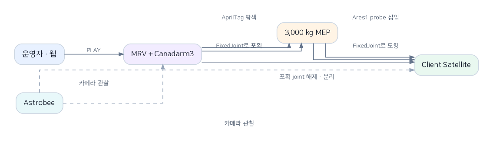
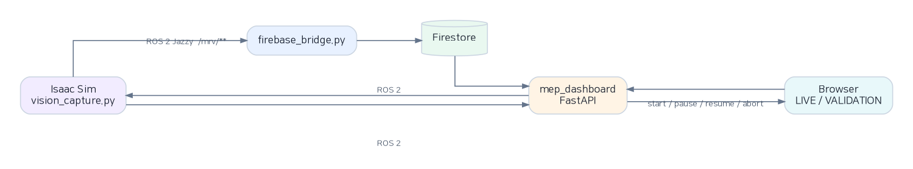
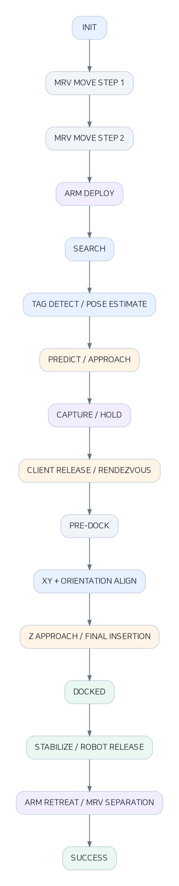
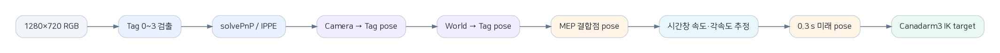
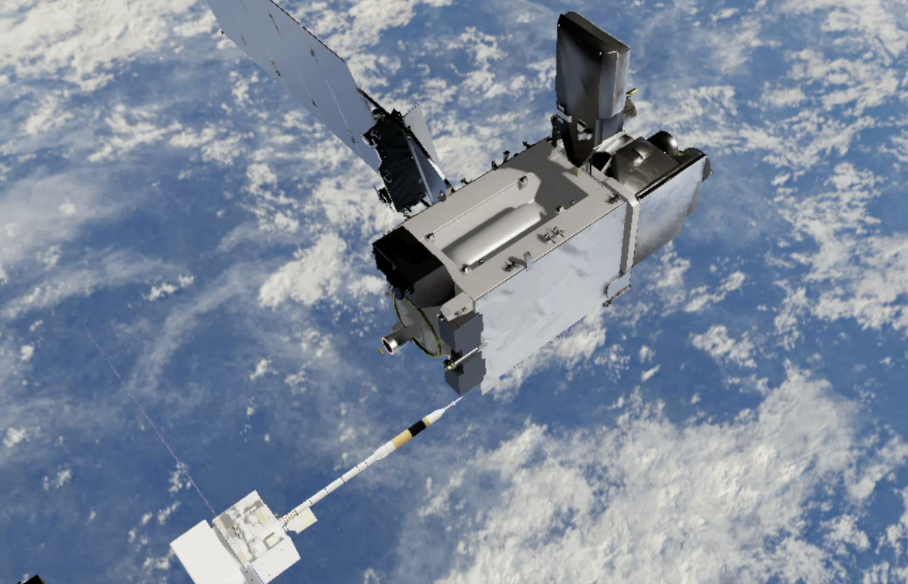
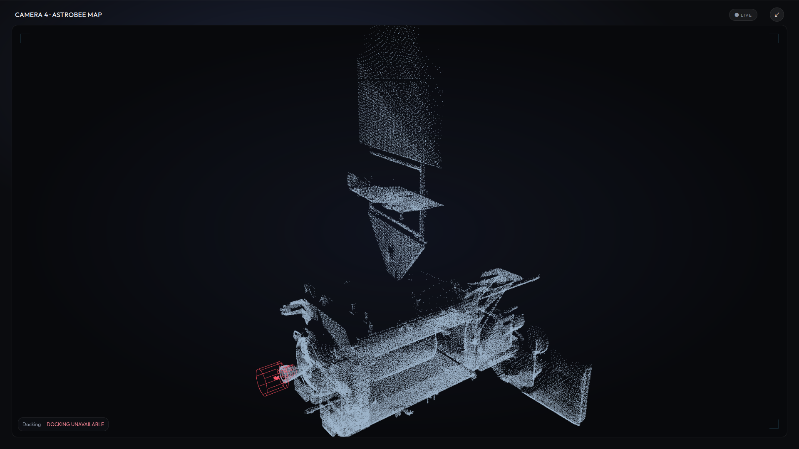

# 00. 팀 온보딩 · 시스템 아키텍처 한눈에 보기

이 문서 하나로 **"이 프로젝트가 뭘 하고, 어떤 프로세스들이 어떻게 얽혀 있고, 임무가 어떤 순서로 진행되는지"** 를 15분 안에 파악하는 것이 목표입니다. 핵심 수치는 설정값·과거 실측·계산값으로 구분하며, 설치·실행 명령과 상세 수용 기준은 각 절 하단 링크에서 확인할 수 있습니다.

기준 브랜치: `main`

## 목차

1. [프로젝트 한 줄 요약](#1-프로젝트-한-줄-요약)
2. [시스템 아키텍처 — 프로세스와 통신](#2-시스템-아키텍처--프로세스와-통신)
3. [핵심 객체와 역할 분담](#3-핵심-객체와-역할-분담)
4. [임무 실행 흐름](#4-임무-실행-흐름)
5. [비전 파이프라인 — MEP를 어떻게 찾는가](#5-비전-파이프라인--mep를-어떻게-찾는가)
6. [Astrobee 안전 게이트](#6-astrobee-안전-게이트)
7. [화면으로 보는 결과물](#7-화면으로-보는-결과물)
8. [더 깊이 알고 싶다면](#8-더-깊이-알고-싶다면)

---

## 1. 프로젝트 한 줄 요약

**MRV(서비서 우주선)가 Canadarm3 손목 카메라로 표류하는 3,000 kg MEP(수명연장 모듈)를 찾아 붙잡고, MEP 끝의 Ares1 probe를 목표 위성(Client Satellite)의 추력기 노즐에 삽입해 도킹한 뒤, MEP를 위성에 남겨두고 물러나는 임무를 Isaac Sim에서 시뮬레이션하는 프로젝트입니다.**

Astrobee는 팔·도킹 제어 명령을 내리지 않습니다. 주변을 관찰해 만든 depth 맵으로 도킹 통로의 장애물을 판정하고, 그 결과를 임무의 안전 게이트에 제공합니다. ROS 2와 웹 대시보드는 임무를 시작·중지하고 상태·영상·오차·실행 결과를 기록합니다.

---

## 2. 시스템 아키텍처 — 프로세스와 통신

시뮬레이터(GPU PC)와 기록·모니터링(모니터링 PC)을 분리할 수도, 한 대에서 다 돌릴 수도 있습니다. 세 프로세스가 각자 하나의 책임만 집니다.

| 프로세스 | 실행 위치 | 책임 |
|---|---|---|
| **Isaac Sim** (`vision_capture.py`) | GPU PC | 물리 시뮬레이션, 상태 머신 실행, `/mrv/**` 토픽 발행 |
| **FastAPI 대시보드** (`mep_dashboard/backend/app.py`) | 모니터링 PC | ROS 2 실시간 값을 웹에 중계(LIVE), Firestore 실행 이력 조회(VALIDATION), 운영 명령 전달 |
| **firebase_bridge.py** | 모니터링 PC | ROS 2 텔레메트리를 Firestore에 기록, 세션 영상(mp4) 인코딩 |

두 PC를 나눠 쓰는 경우 `ROS_DOMAIN_ID`가 같아야 통신됩니다.

> 근거: [README.md](../README.md#0-시스템-개요), [02_system_requirements.md](02_system_requirements.md)

---

## 3. 핵심 객체와 역할 분담

| 객체 | 역할 | 구현 방식 | 핵심 코드 |
|---|---|---|---|
| **MRV** | Canadarm3를 싣고 MEP에 접근하는 서비스 우주선 | 선체·팔의 root pose를 운동학적으로 이동 (추력 동역학 아님) | [`mrv_approach.py`](../project/srb/tasks/manipulation/debris_capture/mrv_approach.py) |
| **Canadarm3** | MEP를 탐색·포획하고 probe를 위성 노즐까지 운반 | 7개 관절 DLS IK로 매 step 추종 | [`vision.py`](../project/srb/tasks/manipulation/debris_capture/vision.py) |
| **MEP** | Client Satellite에 전달할 임무연장 모듈 | 3,000 kg 무중력 강체, 병진·회전 속도 보유 | [`task.py`](../project/srb/tasks/manipulation/debris_capture/task.py) |
| **Ares1 probe** | MEP와 위성을 잇는 도킹 핀 | 실행 시 MEP 메시에서 축·끝점·반경을 측정 | [`docking.py`](../project/srb/tasks/manipulation/debris_capture/docking.py) |
| **Client Satellite** | MEP를 인수하는 목표 위성 | 노즐 축·도킹점을 실행 시 측정, moving 시나리오는 동적 강체로 표류 | [`moving_dock.py`](../project/srb/tasks/manipulation/debris_capture/moving_dock.py) |
| **Astrobee** | 임무 관찰 및 도킹 통로 안전 게이트 | collider 없는 시각 모델, 정해진 경로를 운동학적으로 순회 | [`astrobee.py`](../project/srb/tasks/manipulation/debris_capture/astrobee.py) |

**"흡착"과 "도킹"의 정확한 의미** — 화면에서는 팔 끝이 MEP에 흡착하고, probe가 위성에 결합하는 것처럼 보이지만 실제 흡입력·자기력을 계산하지 않습니다. 비전 제어기가 위치·자세·상대속도 조건을 모두 만족시키면 `CaptureManager` / `DockingManager`가 그 순간의 상대 pose를 그대로 고정하는 `UsdPhysics.FixedJoint`를 생성합니다. 그래서 결합 순간에 물체가 튀지 않습니다.

> 근거: [07_pipeline_implementation_guide.md §2](07_pipeline_implementation_guide.md#2-먼저-알아야-할-객체)

---

## 4. 임무 실행 흐름

웹 대시보드에 보이는 7단계는, 코드 내부 상태 머신(`vision_capture_demo.py:State`)을 이해하기 쉽게 묶은 것입니다.

| # | 웹 단계 | 내부 동작 |
|---|---|---|
| 1 | MRV MOVE + ASTROBEE | MRV 2구간 이동, Canadarm3 전개, Astrobee 관찰 시작 |
| 2 | MEP SEARCH | AprilTag 검출 → pose 추정 → 0.3 s 뒤 위치 예측 |
| 3 | MEP ATTACH | 단계별 감속 접근 → 조건 검사 → MEP FixedJoint 생성 |
| 4 | DOCK PREP | Client release, 속도 정합, 위치·자세 정렬 (기본 모드에서 동시 추종) |
| 5 | DOCKING | 깊이 확인, Z축 접근, 최종 삽입, MEP–위성 FixedJoint 생성 |
| 6 | DOCK COMPLETE | 안정화, Canadarm3–MEP joint 해제, 팔·MRV 후퇴 |
| 7 | ORBIT TRANSFER | 도킹 후 MRV 이격·`SUCCESS` 뒤 지속 이동은 동작. 현재 대시보드 코드에서는 6단계로 매핑되며 별도 궤도 변경 상태는 없음 |

위 그림의 `XY + ORIENTATION ALIGN`은 `legacy` 분기입니다. 현재 기본값인 `coupled_predictive`에서는 `PRE_DOCK_APPROACH → POSITION_ATTITUDE_ALIGN → ALIGNMENT_CHECK → Z_APPROACH` 순으로 진행합니다.

실패 상태는 실패한 단계 번호를 유지합니다 (1단계로 되돌아가지 않음).

**도킹 제어 모드** — 4~5단계의 정렬·삽입 제어는 두 가지 구현 중 하나를 씁니다. `project/config/vision_capture.yaml`의 `docking_control.mode` 기본값은 표류하는 위성의 예측 pose를 위치·자세 동시 추종하는 **`coupled_predictive`** 이며, 기존 순차 제어인 **`legacy`** 로도 전환할 수 있습니다 (`--set docking_control.mode=legacy`). 기본값으로 설정된 사실이 Isaac Sim 종단 성능 검증을 뜻하지는 않습니다.

**정량 스냅샷 — 과거 실행 기록** (현재 기본 제어기의 성능 지표가 아님)

| 지표 | 당시 기록 | 해석 |
|---|---:|---|
| MEP 포획 성공 | 7/10 = 70% | 판정 런 10건; 당시 six_dof 코드 계열은 별도 4/4 |
| 도킹 성공 | 6/8 = 75% | 정지 Client 3/3, 이동 Client 3/5; 표본이 작음 |
| 이동 Client 도킹 반경오차 | 39.97~39.98 mm | 당시 40 mm 결합 공차까지 표시값 기준 0.02~0.03 mm 여유. 수치 반올림과 실행 간 변동은 반영하지 않음 |

출처와 실행 조건은 [01_business_requirements.md의 KPI](01_business_requirements.md#5-성공-지표-kpi)를 참고합니다.

> 근거: [07_pipeline_implementation_guide.md §3, §8](07_pipeline_implementation_guide.md#3-전체-실행은-하나의-상태-머신이다), `project/config/vision_capture.yaml`

---

## 5. 비전 파이프라인 — MEP를 어떻게 찾는가

MEP의 정답 좌표를 제어기에 직접 넘기지 않습니다. Canadarm3 손목 카메라에 보이는 4개의 AprilTag(`tag36h11`)만으로 결합점 pose를 구합니다.

시뮬레이터가 아는 MEP의 실제(ground truth) pose는 **오차 계산·결과 판정에만** 쓰고 제어 목표에는 넣지 않습니다. 이것이 "비전 기반 제어"와 "좌표를 알고 움직이는 데모"의 차이입니다. 반면 **위성 도킹 쪽 pose는 처음부터 물리엔진이 알고 있는 값**을 그대로 쓰며(별도 비전 추정 없음), USD 메시에서 실행 시 측정한 도킹 프레임 기준으로 오차만 보정합니다.

> 근거: [07_pipeline_implementation_guide.md §5, §8](07_pipeline_implementation_guide.md#5-단계-2--apriltag로-mep-찾기)

---

## 6. Astrobee 안전 게이트

Astrobee는 MRV·MEP·위성에 운동 명령을 내리지 않습니다. 도킹 포트 근접 관측점에서 시작해 위성 위·아래의 두 링을 각각 45°/135°/225°/315° 방위로 돌며 RGB-D 포인트 클라우드를 쌓아, **도킹 통로에 위성 자체 구조물이 아닌 물체가 있는지** 판정합니다. 현재 설정은 dwell당 depth 3회, 3 cm 보셀입니다.

설정대로 각 지점을 한 번씩 방문하면 **근접 관측점 1 + 링 관측점 2×4 = 9곳**입니다. 지점당 5 s 체류이므로 체류 시간만 합치면 **45 s**, 체류 중 계획된 depth 샘플은 **9×3 = 27회**입니다. 이동·초기 접근 시간과 이동 중 1 s 간격의 추가 샘플은 제외한 계산값이며, 임무가 먼저 종료되면 9곳을 모두 방문하지 않을 수 있습니다.

- 스캔 맵에서 위성 USD 메시로 설명되는 점(노즐 벽·테두리 등)과 MEP 자기 모델은 제외
- 남은 점이 노즐 안쪽 + 출구 앞 금지 구역에 2회 이상 확정되면 장애물
- 장애물 확정 즉시, 임무가 어느 단계에 있든 `DOCKING_UNAVAILABLE`로 전이하고 로봇을 정지
- 통로를 충분히 못 봤어도(관측 부족) 삽입 직전 게이트에서 도킹 불가로 판정

> 근거: [07_pipeline_implementation_guide.md §11](07_pipeline_implementation_guide.md#11-astrobee는-무엇을-하고-무엇을-하지-않는가)

---

## 7. 화면으로 보는 결과물

| | |
|---|---|
|  MEP의 Ares1 probe가 위성 추력기 노즐(분홍 링)에 접근하는 장면 | .png) 위성 태양광 패널과 도킹 구조를 포함한 넓은 시야 |
|  LIVE MISSION 탭 — 뷰포트, 임무 진행률(1~7단계), 위치 오차 그래프, 카메라 4면 |  CAMERA 4 · ASTROBEE MAP — Astrobee가 쌓은 포인트 클라우드와 도킹 금지 구역(빨간 실린더) |

---

## 8. 더 깊이 알고 싶다면

| 문서 | 내용 |
|---|---|
| [README.md](../README.md) | 설치·실행 명령, 7단계 표, 저장소 구조 |
| [01_business_requirements.md](01_business_requirements.md) | 비즈니스 요구사항, KPI, 로드맵 |
| [02_system_requirements.md](02_system_requirements.md) | 시스템 요구사항, 실행 환경, 정량 기준 |
| [03_interface_requirements.md](03_interface_requirements.md) | ROS 2 토픽, Firestore 스키마, REST API |
| [04_scenario.md](04_scenario.md) | 전체 파이프라인 시나리오, 실측 결과 |
| [05_branch_history.md](05_branch_history.md) | 브랜치 계보와 개발 이력 |
| [06_references_and_improvements.md](06_references_and_improvements.md) | 논문 레퍼런스와 도킹 제어 개선 근거 |
| [07_pipeline_implementation_guide.md](07_pipeline_implementation_guide.md) | 코드 레벨 동작 원리, 논문 적용 상세 해설 (가장 깊은 문서) |
